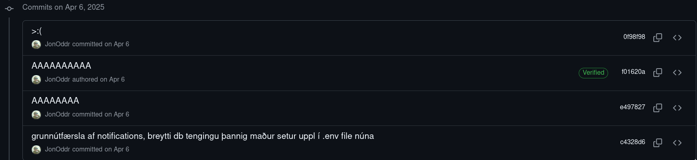
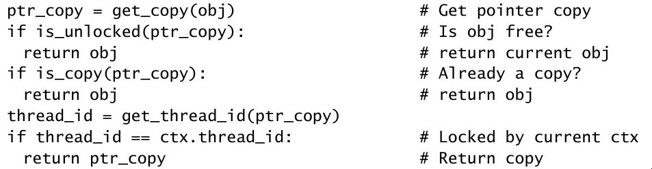

---
options:
  end_slide_shorthand: true
---

# Vinnulag

---

# Commit skilaboð og README skjöl

- https://github.com/**koltepri**/Verkefni2-Group32-Vefforitun1
  - gerið eins og ég segi, ekki eins og ég geri



- https://github.com/mfontanini/**presenterm**

- https://github.com/microsoft/**vscode**

- Frjálst val

---

# Commit uppsetning

1. Hvað breyttist (1 lína)
   - Virkni eða útlit, ekki kóðinn!
2. Afhverju var breytingin gerð?
3. Hvað lærðir þú (ef eitthvað?)

---

# Komment

```javascript
// Add a horizontal scroll
bar hScrollBar = new JScrollBar(JScrollBar.HORIZONTAL);
add(hScrollBar, BorderLayout.SOUTH);
// Add a vertical scroll bar
vScrollBar = new JScrollBar(JScrollBar.VERTICAL);
add(vScrollBar, BorderLayout.EAST);
// Initialize the caret-position related values
caretX     = 0;
caretY     = 0;
caretMemX  = null;
```



---

# Gæði

- Auðlæsi (e. readability)
- Viðhaldsþægni (e. maintainability)
- Einfaldleiki (e. simplicity)
- réttmæti , silvirkni, stöðugleiki, hraði, endurnýtanleiki ... etc

---

# Glósur

- HTML Tögg
- CSS
  - Box model (margin, border, padding)
  - Veljarar (Selectors (. eða #))
  - Útlitsnið (Layout (t.d flex))
  - Staðsetning (t.d absolute)
- Javascript
  - Að velja HTML tögg
  - Að breyta, bæta við eða eyða HTML
  - Atburðir (e. Events)

---

# Ítarefni

- Klassískt (stutt) : https://dhwthompson.com/2019/my-favourite-git-commit
- Meira um efra (stutt) : https://mtlynch.io/no-longer-my-favorite-git-commit/
- (langt): https://refactoringenglish.com/chapters/commit-messages/
- Bók um stærðfræðivinnulag : How to solve it (G. Polya)
  - biðja gervigreindinna llum að draga saman meginefnið
